# Как устроено приложение «Всё рядом»

> Подробный вводный документ для разработчика, который впервые открыл проект.
> Состояние репозитория описано на 26 августа 2026 года. Исполняемый источник
> статусов и порядка работ — [`MVP_CHECKLIST.md`](../MVP_CHECKLIST.md); этот файл
> объясняет систему, но не заменяет checklist, ADR или код.

## 1. Что это за приложение

«Всё рядом» — мобильный P2P-сервис, в котором один человек может сдать свою вещь
другому человеку поблизости на несколько дней. P2P означает *person to person*:
основные стороны сделки — обычные пользователи, а «Всё рядом» предоставляет
площадку, правила, поиск, бронирование и инструменты безопасной передачи.

Один аккаунт не делится на постоянные роли «арендатор» и «владелец». Пользователь
с ролью `USER` одновременно может:

- просматривать и брать в аренду чужие вещи — в коде это `borrower`;
- публиковать и сдавать свои вещи — в коде это `lender`;
- управлять своими бронированиями, объявлениями, обращениями и сессиями.

Отдельная роль `ADMIN` используется только для сотрудников. Даже она не даёт
всех прав автоматически: оператору назначаются отдельные полномочия
`MODERATION`, `SUPPORT`, `KYC_REVIEW` или `FINANCE`.

### Граница MVP

В MVP есть одна физическая вещь в одном объявлении, цена за календарный день в
рублях и личная передача. Продажа, обмен, дарение, услуги, корзина, складской
остаток и собственная доставка не входят в текущий продукт.

На старте разрешены консервативные категории: проекторы и экраны, фото- и
видеотехника, игровые приставки, настольные игры, музыкальные инструменты и
бытовые швейные машины. Категории с повышенным риском закрыты до отдельного
решения, а явно опасные или незаконные вещи запрещены.

Важно различать три состояния функций:

| Состояние | Что означает | Примеры |
| --- | --- | --- |
| Реализовано | Есть код, API и проверки; функцию можно запускать локально | OTP, каталог, объявления, бронирования, чат, inbox, support |
| Карта и демо-оплата | Карта работает через Yandex Tiles; оплата остаётся локальной проверкой без списания | приблизительные точки и демо-оплата |
| Закрыто gate | Код нельзя считать доступным пользователям до юридического, provider или store-решения | production payments, KYC, push-провайдеры, публичный booking release |

## 2. Система целиком

В репозитории находятся четыре пользовательских приложения вокруг одного
backend-монолита.

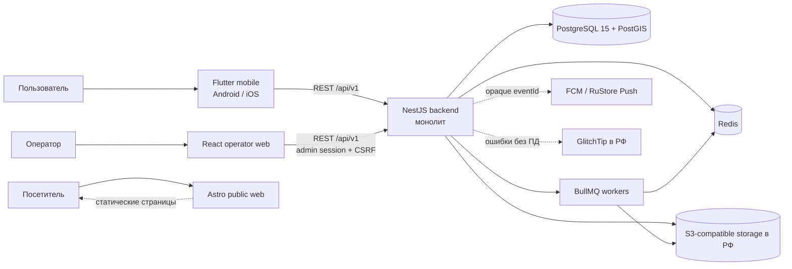

Главная идея схемы:

1. Flutter и operator web не подключаются к базе напрямую.
2. Они обращаются к единому REST API.
3. Backend проверяет данные и права, выполняет бизнес-правила и только затем
   изменяет PostgreSQL.
4. Redis хранит короткоживущие данные и очереди, а S3 — бинарные файлы.
5. Публичный Astro-сайт отделён от пользовательских данных и авторизации.

## 3. Технологии и зачем они нужны

### Mobile

| Технология | Простое объяснение | Где используется |
| --- | --- | --- |
| Flutter | UI-фреймворк для одной кодовой базы Android и iOS | весь каталог `mobile/` |
| Dart | язык Flutter-приложения | `mobile/lib/**/*.dart` |
| Riverpod | хранит состояние и связывает UI с логикой | providers и controllers |
| GoRouter | описывает маршруты, redirects и нижнюю навигацию | `core/router/` |
| Dio | HTTP-клиент с timeout и interceptor | `core/network/` |
| Freezed | генерирует неизменяемые модели и union states | DTO и состояния |
| json_serializable | генерирует безопасный JSON parsing | файлы `*.g.dart` |
| flutter_secure_storage | хранит access/refresh tokens в защищённом хранилище ОС | `token_storage.dart` |
| shared_preferences | хранит несекретные локальные настройки | onboarding и consent |
| form_builder | формы и проверка пользовательского ввода | auth, profile, item forms |
| Yandex Tiles API + flutter_map | карта каталога и выбор точки передачи | coarse-маркеры и кластеры без нативного SDK |
| Firebase Messaging | транспорт FCM | dependency есть; provider-gated доставка не включена по умолчанию |
| sentry_flutter | отправка очищенных ошибок | только в self-hosted GlitchTip |

### Backend

| Технология | Простое объяснение | Роль |
| --- | --- | --- |
| NestJS 11 | модульный HTTP-фреймворк Node.js | REST API и dependency injection |
| TypeScript | JavaScript со статическими типами | весь backend |
| Prisma | типизированная работа с БД и миграциями | `prisma/schema.prisma`, services |
| PostgreSQL 15 | постоянное хранилище бизнес-данных | users, items, bookings и другое |
| PostGIS | географические типы и запросы PostgreSQL | поиск вещей в радиусе |
| Redis 7.4 | быстрое хранилище с TTL | OTP, refresh/admin sessions, BullMQ |
| BullMQ | надёжные фоновые задания поверх Redis | фото, outbox, push delivery |
| JWT | короткий access token мобильного пользователя | mobile API authorization |
| Swagger/OpenAPI | интерактивное описание API | только non-production `/api/docs` |
| Sharp | декодирование и безопасное перекодирование изображений | upload worker |
| AWS SDK for S3 | presigned upload/download для S3-compatible провайдера | фото и приватные evidence |
| Jest | unit- и integration-тесты | backend tests |

### Web и эксплуатация

| Часть | Технологии | Назначение |
| --- | --- | --- |
| Operator | React 19, Vite, TypeScript | закрытая поддержка и модерация |
| Public web | Astro 7, TypeScript | документы, support и удаление аккаунта |
| Containers | Docker, Docker Compose | local/test/production окружения |
| Monitoring | Prometheus rules, GlitchTip | метрики, alerts и очищенные ошибки |
| Automation | Makefile, shell/Node scripts, GitHub Actions | единые проверки, сборка и release gates |

## 4. Карта репозитория

```text
sosedi-app/
├── backend/                  NestJS API, Prisma, workers и тесты
│   ├── prisma/               схема БД, миграции и seed категорий
│   ├── src/                  модули приложения
│   └── test/                 e2e-тесты с настоящими PostgreSQL/Redis
├── mobile/                   Flutter-приложение Android/iOS
│   ├── lib/core/             сеть, router, storage, theme, observability
│   ├── lib/features/         продуктовые функции
│   ├── lib/shared/           общие модели и widgets
│   ├── test/                 unit/widget tests
│   └── integration_test/     сквозной smoke
├── operator/                 закрытый React/Vite интерфейс операторов
├── public-web/               публичный статический Astro-сайт
├── docs/                     технические, продуктовые и operational документы
├── docs/adr/                 принятые архитектурные решения
├── docs/screenshots/         реальные снимки Flutter UI на safe fixtures
├── ops/                      production env, monitoring, backup, GlitchTip
├── scripts/                  release/smoke/verification scripts
├── docker-compose.yml        локальные PostgreSQL/PostGIS и Redis
├── docker-compose.test.yml   изолированная test-инфраструктура
├── docker-compose.production.yml
├── Makefile                  основные команды проекта
└── MVP_CHECKLIST.md          scope, порядок, DoD и текущий прогресс
```

Не нужно начинать изучение с каждой миграции или с generated-файлов.
Оптимальный порядок для новичка:

1. этот документ;
2. `mobile/lib/core/router/app_router.dart` — какие экраны существуют;
3. один feature целиком, например `features/catalog`;
4. соответствующий backend controller и service;
5. `backend/prisma/schema.prisma`;
6. профильный контракт в `docs/`;
7. только затем тесты и миграции.

## 5. Как устроен Flutter-клиент

### 5.1 Запуск приложения

Точка входа — `mobile/lib/main.dart`.

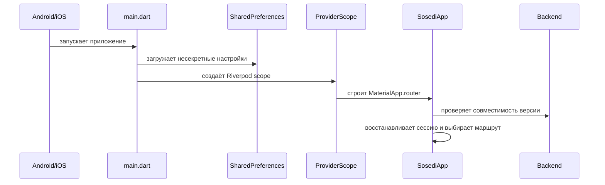

Перед `runApp` настраивается GlitchTip. Затем `SharedPreferences` передаётся в
Riverpod через override. `SosediApp` следит за lifecycle ОС:

- при возврате из background заново валидирует сессию;
- обновляет сообщения и inbox;
- при уходе в background очищает из памяти приватные детали бронирования,
  evidence и состояние экспорта.

### 5.2 Навигация

GoRouter сначала проверяет три условия:

1. не устарела ли версия mobile;
2. пройден ли onboarding;
3. авторизован ли пользователь.

Гостю доступны каталог и публичная карточка вещи. Попытка выполнить приватное
действие, например забронировать вещь, ведёт на OTP-вход и сохраняет безопасный
`returnTo`. После входа пользователь возвращается к исходному действию. Внешний
URL или auth-route нельзя подставить как `returnTo`.

После onboarding приложение показывает пять постоянных вкладок:

| Вкладка | Route | Назначение |
| --- | --- | --- |
| Найти | `/catalog` | поиск, фильтры, список и режим карты |
| Брони | `/bookings` | аренды пользователя как borrower и lender |
| Сдать | `/items/mine` | свои объявления и создание нового |
| Входящие | `/inbox` | надёжная лента событий |
| Профиль | `/profile` | аккаунт, документы, support и настройки |

### 5.3 Архитектура feature

Обычный поток зависимости выглядит так:

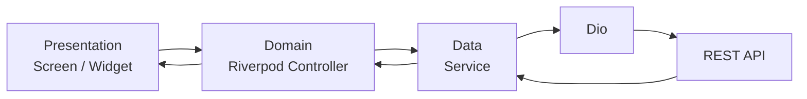

Например, экран каталога не должен самостоятельно строить URL и разбирать JSON.
Он наблюдает `catalogController`; controller управляет загрузкой и фильтрами;
`CatalogService` вызывает Dio; модели Freezed разбирают ответ.

Внутри feature используются до трёх папок:

- `presentation/` — экран и простые UI-компоненты;
- `domain/` — состояние и действия пользователя;
- `data/` — DTO, local storage и HTTP service.

Generated-файлы `*.freezed.dart` и `*.g.dart` руками не редактируются. После
изменения аннотированной модели выполняется `make mobile-gen`.

### 5.4 Сеть и сессия

Dio автоматически добавляет:

- `Authorization: Bearer <accessToken>` для приватного запроса;
- стабильный `X-Installation-Id` UUID;
- `X-Api-Version: 1`;
- версию и платформу приложения.

Access token живёт 15 минут, refresh token — до 30 дней. При `401` interceptor
делает один общий refresh даже если одновременно упало несколько запросов,
сохраняет новую пару токенов и повторяет исходный запрос. Если refresh отклонён,
токены удаляются и router переводит пользователя к входу. Временная ошибка сети
не должна уничтожать рабочую сессию.

Секретные токены хранятся в `flutter_secure_storage`. В `SharedPreferences`
разрешены только несекретные настройки вроде флага onboarding или analytics
consent.

## 6. Пользовательские сценарии со скриншотами

Все снимки ниже созданы из реального Flutter UI на локальных безопасных
фикстурах, размер каждого — 430×932. Это не макеты дизайнера и не production
данные. Полный индекс и команда перегенерации находятся в
[`docs/screenshots/README.md`](screenshots/README.md).

### 6.1 Первый запуск и OTP-вход

1. Пользователь читает onboarding.
2. Гость может перейти в публичный каталог.
3. Для приватного действия вводит российский номер телефона.
4. Backend нормализует номер, применяет лимиты по телефону, installation и IP,
   сохраняет OTP в Redis и вызывает SMS provider.
5. Пользователь вводит шестизначный код.
6. Backend создаёт пользователя при первом входе и возвращает access/refresh
   tokens.

<table>
  <tr>
    <td>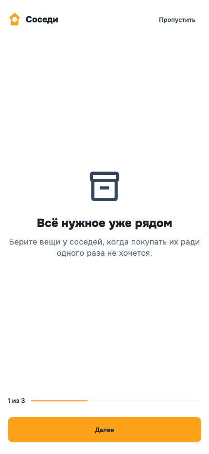</td>
    <td>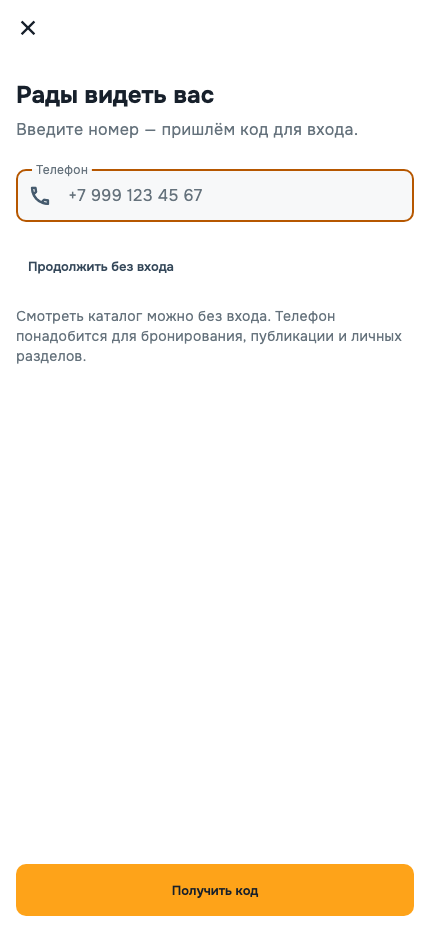</td>
    <td>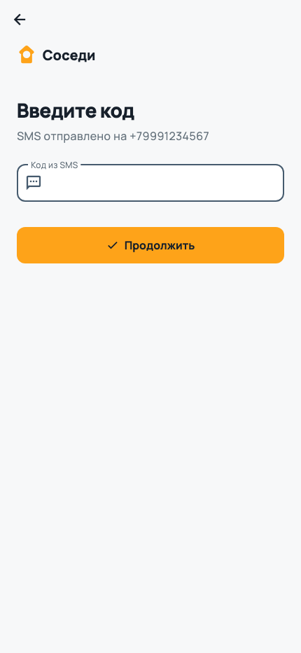</td>
  </tr>
  <tr>
    <td align="center">Onboarding</td>
    <td align="center">Телефон</td>
    <td align="center">OTP</td>
  </tr>
</table>

Ответ запроса OTP намеренно не раскрывает, существовал ли аккаунт. Основные
лимиты: три OTP на телефон за 10 минут, пять неверных кодов и блокировка на 30
минут; есть дополнительные device/IP/global ограничения расходов SMS.

### 6.2 Поиск вещи

Каталог получает только объявления `APPROVED`. Пользователь может искать по
тексту, категории, цене, доступности и радиусу до 50 км. Геопоиск выполняется на
сервере с PostGIS (`ST_DWithin`, `ST_Distance`).

Публичный ответ никогда не содержит улицу, дом или точные координаты хранения.
Он отдаёт район, стабильную приблизительную точку и грубую дистанцию. Точный
pickup-адрес доступен только участникам подтверждённого бронирования и только в
разрешённом окне состояния.

<table>
  <tr>
    <td>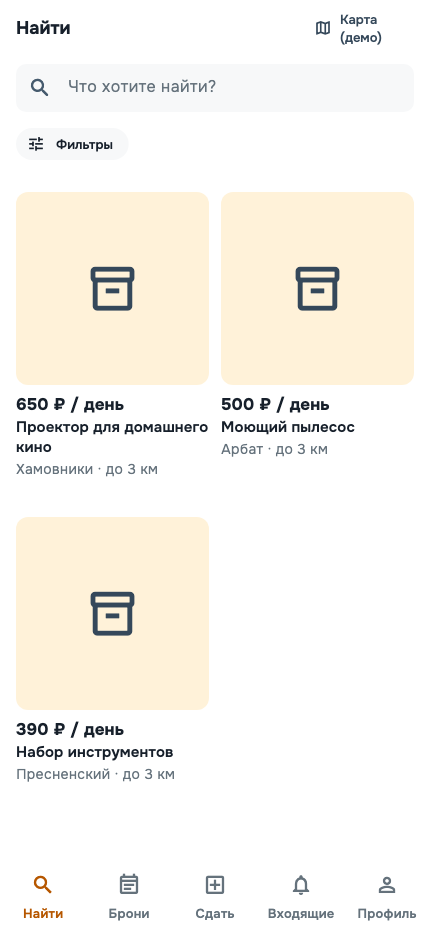</td>
    <td>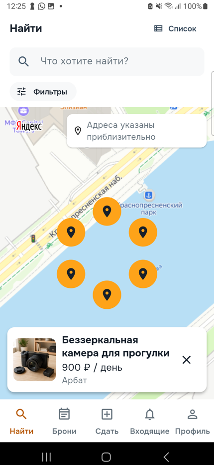</td>
    <td>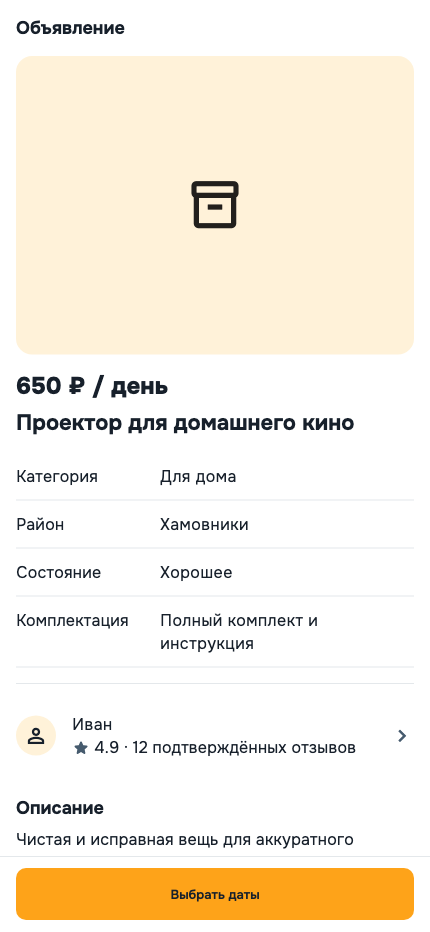</td>
  </tr>
  <tr>
    <td align="center">Список</td>
    <td align="center">Карта каталога</td>
    <td align="center">Карточка</td>
  </tr>
</table>

Карта каталога загружает Yandex Tiles и показывает только coarse-координаты.
Близкие точки группируются в кластеры; карточка с фото появляется после касания
маркера. На телефоне список и карта переключаются, а от 840 px работают рядом в
split view с общими фильтрами и выбранной вещью. Ручной выбор района работает
без геолокации. Оценка нагрузки и privacy-контракт описаны в
[`yandex-tiles-capacity-and-budget.md`](yandex-tiles-capacity-and-budget.md) и
[`exact-location-privacy.md`](exact-location-privacy.md). Ограничения ключа,
публикация consent и остальные production gates относятся к незакрытому этапу
Mobile Map.

### 6.3 Публикация своей вещи

Пользователь открывает вкладку «Сдать» и создаёт объявление. Он указывает:

- название, описание и разрешённую категорию;
- состояние и комплектность;
- условия безопасного использования и личной передачи;
- цену за день;
- приватный точный адрес/координаты и отдельный публичный район;
- фотографии;
- подтверждение актуальной версии правил публикации.

<table>
  <tr>
    <td>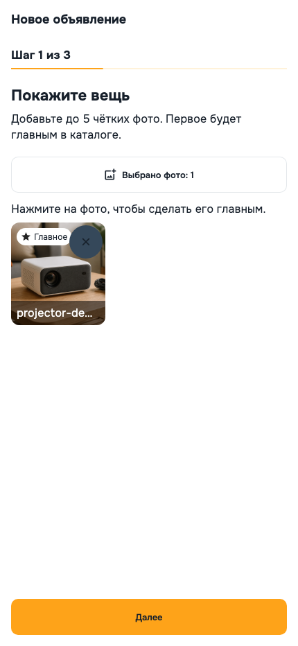</td>
    <td>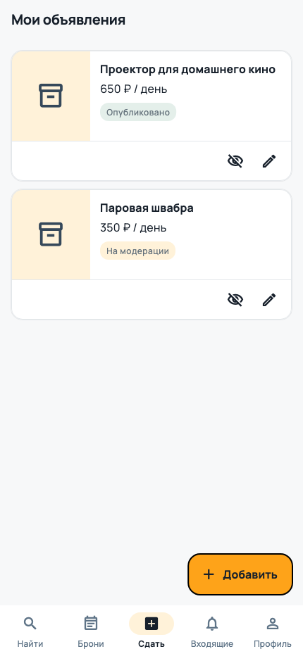</td>
    <td>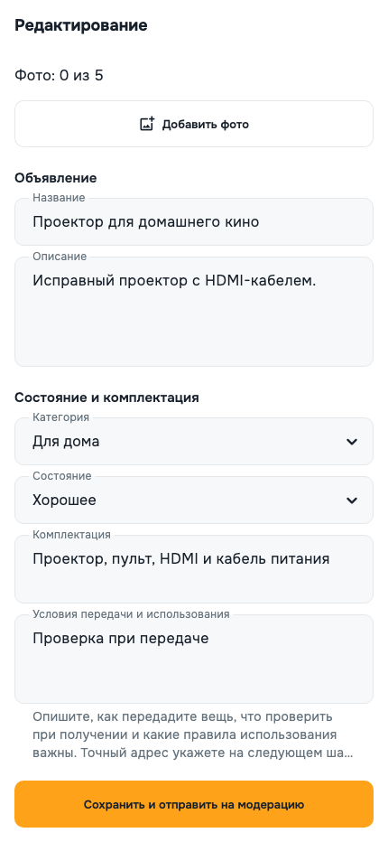</td>
  </tr>
  <tr>
    <td align="center">Создание</td>
    <td align="center">Мои вещи</td>
    <td align="center">Редактирование</td>
  </tr>
</table>

Новое объявление получает `PENDING` и не показывается публично до модерации.
Существенное изменение текста, категории или фотографий снова отправляет его на
модерацию. Владелец может менять или скрывать только собственный Item — одной
роли `USER` для этого недостаточно, backend всегда сверяет `ownerId`.

#### Как загружается фотография

Бинарный файл не проходит через обычный JSON endpoint NestJS:

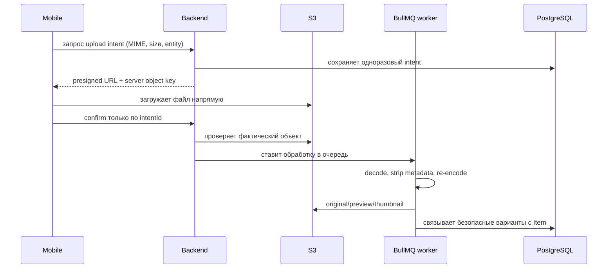

Backend генерирует ключ объекта сам, проверяет owner, bucket, MIME, размер и
magic bytes. Изображение декодируется и перекодируется, EXIF/GPS удаляется.
Приватные материалы передачи, support и KYC нельзя отдавать постоянным URL —
только короткоживущим presigned download URL после повторной проверки прав.

### 6.4 Бронирование

Пользователь выбирает включительные даты по московскому календарю. Один день —
это одинаковые `startDate` и `endDate`; максимальная аренда — 30 дней, начало —
не дальше 90 дней. Цена вычисляется backend, а не принимается от mobile:

```text
число календарных дней × server pricePerDay = rental subtotal
```

В текущем pilot snapshot показываются оплата при передаче, комиссия платформы
0 ₽ и отсутствие залога. Mobile передаёт Item, даты, idempotency ID и принятые
версии документов. Backend сам берёт lender, ставку и server timestamp.

<table>
  <tr>
    <td>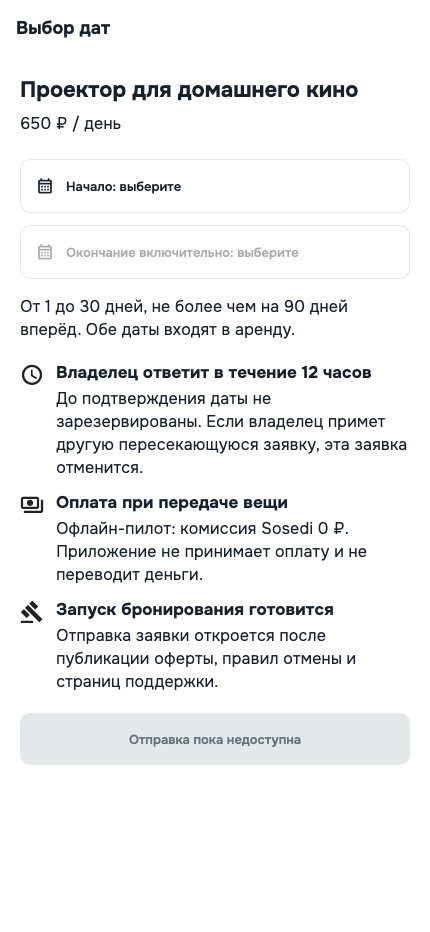</td>
    <td>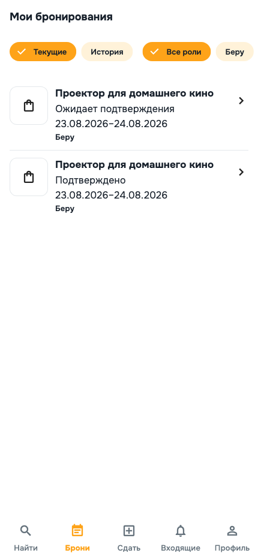</td>
    <td>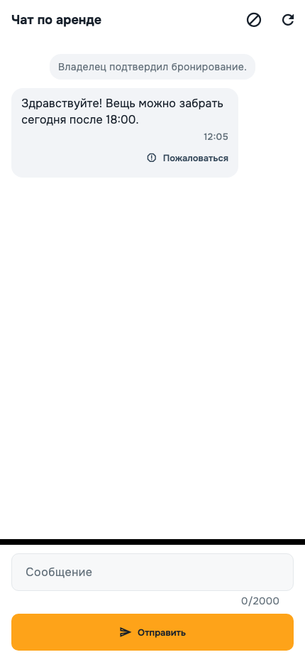</td>
  </tr>
  <tr>
    <td align="center">Выбор дат и условий</td>
    <td align="center">Брони обеих сторон</td>
    <td align="center">Booking-scoped чат</td>
  </tr>
</table>

`POST /bookings` по умолчанию закрыт с
`BOOKING_LEGAL_GATE_CLOSED`. Он открывается только для утверждённых, не draft
версий оферты и cancellation policy. Наличие экрана не означает разрешение
публичного production-бронирования.

#### Жизненный цикл Booking

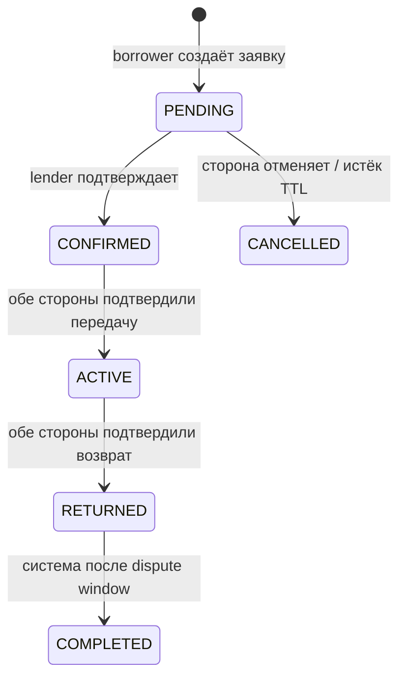

`PENDING` действует 12 часов и ещё не резервирует вещь жёстко. Несколько
пересекающихся заявок допустимы. Подтверждение под блокировками PostgreSQL
выбирает ровно одну, а конкурирующие заявки отменяет атомарно.

Передача и возврат фиксируются отдельными immutable acts с приватными фото.
Автор создаёт act, а вторая сторона подтверждает. История переходов append-only:
обычный код не может переписать или удалить уже записанный аудит.

Booking, Payment, Payout и Dispute — разные state machine. Статуса `PAID` у
Booking нет, а payment webhook не имеет права самовольно менять аренду.
Production online payment, refund, payout и финансовый dispute пока закрыты
provider/legal gates. Экран демо-оплаты не списывает деньги и не меняет server
state.

### 6.5 Чат, события и уведомления

В MVP нет свободных личных сообщений. Чат существует только внутри конкретного
Booking, доступен его borrower и lender и поддерживает текст до 2000 символов.
Client UUID делает повторную отправку идемпотентной. Block/report проверяются на
backend; текст сообщения не попадает в URL, log или push.

Надёжная доставка события устроена через transactional outbox:

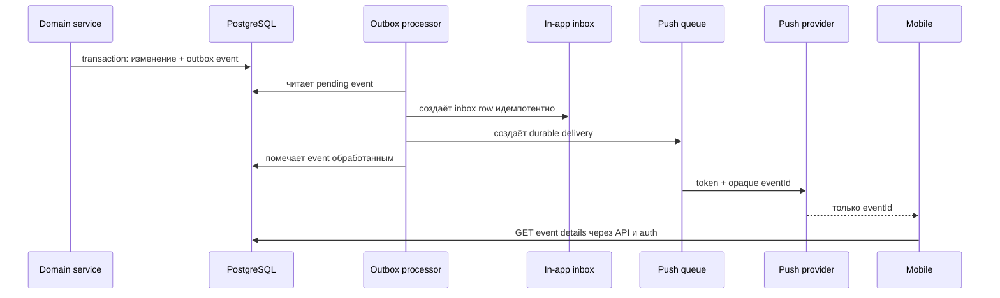

In-app inbox — источник истины. Push является лишь сигналом «появилось событие»
и содержит только непрозрачный `eventId`; телефон, адрес, сумма, чат, JWT и
содержание бронирования не отправляются push-провайдеру.

<table>
  <tr>
    <td>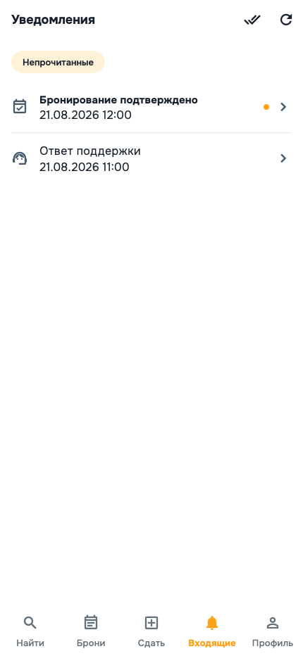</td>
    <td>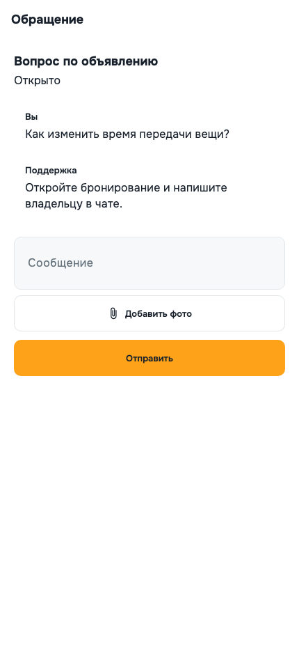</td>
  </tr>
  <tr>
    <td align="center">In-app inbox</td>
    <td align="center">Support ticket</td>
  </tr>
</table>

### 6.6 Профиль, безопасность и данные

Профиль объединяет оба сценария — «беру» и «сдаю». Пользователь может изменить
имя, город и аватар, посмотреть активные сессии, отозвать одну или все сессии,
управлять analytics consent, открыть документы, запросить экспорт, заблокировать
другого пользователя и закрыть аккаунт.

<table>
  <tr>
    <td>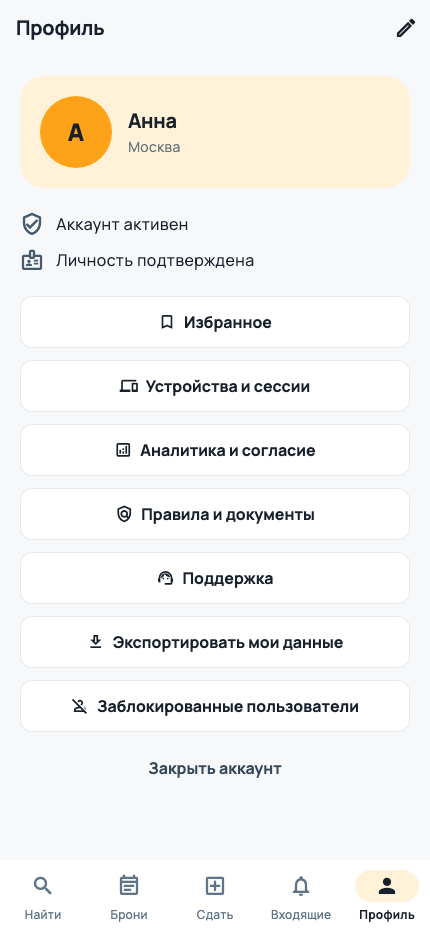</td>
    <td></td>
    <td>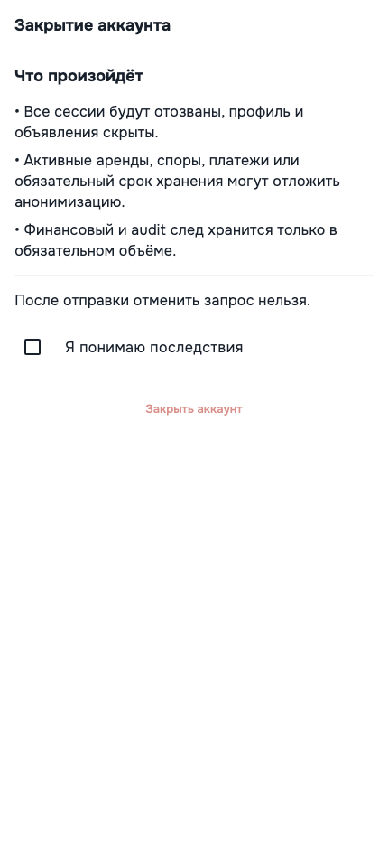</td>
  </tr>
  <tr>
    <td align="center">Профиль</td>
    <td align="center">Сессии</td>
    <td align="center">Закрытие аккаунта</td>
  </tr>
</table>

Закрытие аккаунта сразу отзывает сессии и скрывает профиль/объявления.
Физическая анонимизация может ждать завершения активной аренды, открытого спора
или обязательного retention. Это не обычный `DELETE FROM users`: система
сохраняет минимально необходимый audit/financial trail и удаляет прямые
идентификаторы после исчезновения законного blocker.

## 7. Backend: путь одного HTTP-запроса

Точка входа backend — `backend/src/main.ts`. NestJS создаёт один монолитный
`AppModule`, в котором подключены auth, users, categories, items, upload,
booking, notifications, reports, reviews, support, admin, payments и
observability.

Каждый запрос проходит общий конвейер:

```mermaid
flowchart LR
    REQ[HTTP request] --> PX[trusted proxy / HTTPS]
    PX --> SEC[Helmet + CORS + size/timeouts]
    SEC --> VER[API/mobile version gate]
    VER --> VAL[DTO + ValidationPipe]
    VAL --> GUARD[JWT / role / capability / ownership]
    GUARD --> CTRL[Controller]
    CTRL --> SVC[Service business rules]
    SVC --> DB[(Prisma / Redis / S3)]
    DB --> ENV[success/data/error envelope]
    ENV --> RES[HTTP response]
```

Глобальный prefix — `/api/v1`. `ValidationPipe` преобразует типы, удаляет
неразрешённые поля и отклоняет неизвестные поля. Controller отвечает за HTTP-
контракт, service — за бизнес-правило. Неожиданная ошибка превращается в
безопасный `INTERNAL_SERVER_ERROR` без stack trace для клиента.

Успешный ответ:

```json
{
  "success": true,
  "data": {},
  "error": null
}
```

Ошибка:

```json
{
  "success": false,
  "data": null,
  "error": {
    "code": "VALIDATION_ERROR",
    "message": "Понятное описание"
  }
}
```

### Основные группы API

Все пути ниже имеют prefix `/api/v1`.

| Группа | Примеры | Доступ |
| --- | --- | --- |
| Health | `GET /health`, `/health/live`, `/health/ready` | public/infra |
| Auth | `POST /auth/otp/request`, `/otp/verify`, `/refresh`, `/logout` | public или token-specific |
| Sessions | `GET /auth/me`, `/auth/sessions`, `DELETE /auth/sessions/:id` | authenticated |
| Profile | `GET/PATCH /users/me`, `DELETE /users/me`, data export | authenticated + step-up где нужно |
| Blocks | `GET /users/blocks`, `POST/DELETE /users/blocks/:targetUserId` | authenticated |
| Categories | `GET /categories`, `GET /categories/:slug` | public |
| Items | `GET /items`, `/items/:id`; `POST/PATCH /items`; `/items/mine` | чтение public, mutation owner-only |
| Uploads | presign, photo/avatar confirm, private download | authenticated + object authorization |
| Availability | `/items/:itemId/availability`, `/unavailable-periods` | public read / owner mutation |
| Bookings | create/list/details/confirm/cancel/extend | authenticated participant/lender rules |
| Acts | `/bookings/:id/acts`, confirm и evidence download | participants only |
| Chat | `/bookings/:id/messages`, read, block counterparty | participants only |
| Inbox | `/inbox`, `/inbox/:eventId`, mark read | recipient only |
| Reviews | booking review и public user reviews | verified booking boundary/public read |
| Reports | `POST /reports` | authenticated reporter |
| Support | tickets, messages, attachment download | ticket owner |
| Device tokens | `POST /device-tokens`, delete token | authenticated |
| Admin session | TOTP setup/confirm, step-up, session/logout | admin + MFA |
| Admin work | users, moderation, reports, support | capability + admin session + CSRF |
| Metrics | `GET /internal/metrics` | long bearer token/internal network |

Swagger UI доступен в development по `/api/docs`, JSON — `/api/docs-json`. В
production маршруты Swagger не регистрируются.

## 8. Данные и схема БД

PostgreSQL — источник постоянной истины. Крупные связи можно представить так:

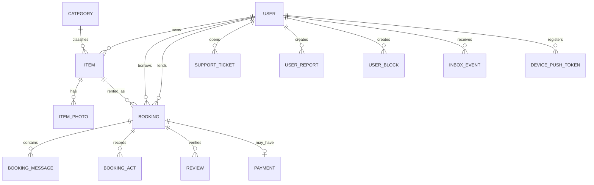

Основные модели:

- `User` — телефон, профиль, role/capabilities, KYC status, блокировка и версия
  сессий;
- `Category` — справочник и deny-by-default политика публикации;
- `Item` — объявление, публичный район и отдельно приватная точная локация;
- `ItemPhoto` и `UploadIntent` — безопасная загрузка изображений;
- `Booking` — стороны, даты, TTL, status и immutable snapshot условий;
- `BookingAct/Evidence/TransitionHistory` — передача, возврат и аудит;
- `BookingMessage`, `Review` — диалог и подтверждённые отзывы;
- `NotificationOutboxEvent`, `InboxEvent`, `PushDelivery` — надёжные события;
- `SupportTicket/Message/Attachment` — поддержка;
- `UserReport`, `UserBlock` — UGC safety;
- `Payment` и `KycDocument` — provisional заготовки, не доказательство готовой
  production-функции;
- `AdminAuditLog` — append-only журнал действий операторов.

Prisma schema — декларативный источник моделей, но реальная БД меняется только
миграциями из `backend/prisma/migrations/`. При добавлении поля недостаточно
изменить TypeScript DTO: обычно требуется schema, migration, service, public/
private DTO, test и документация контракта.

### Где какие данные хранятся

| Хранилище | Данные | Почему |
| --- | --- | --- |
| PostgreSQL/PostGIS | долговечные бизнес-записи, координаты, outbox/inbox, audit | транзакции, constraints, геопоиск |
| Redis | OTP, refresh token families, admin sessions, rate limits, BullMQ | TTL и быстрые атомарные операции |
| Public S3 bucket | очищенные публичные варианты фото Item | медиа отдельно от API/БД |
| Private S3 bucket | evidence, support attachments, gated KYC | доступ только по короткому presigned URL |
| Secure storage телефона | access/refresh tokens | защита средствами ОС |
| SharedPreferences | onboarding и несекретные настройки | простое локальное состояние |

Основные базы, Redis, пользовательские фотографии, приватные материалы и backup
с персональными данными должны размещаться в РФ.

## 9. Operator web

`operator/` — минимальный закрытый интерфейс, а не публичная админка и не замена
backend guards. Он построен на React/Vite и сейчас покрывает:

- обычные support tickets, assignee, сообщения и безопасные вложения;
- список пользователей и блокировку;
- очередь объявлений на модерацию, approve/reject с причиной;
- жалобы и разрешённый контекст;
- выход, idle timeout и очистку чувствительного state из памяти.

Вход состоит из SMS OTP и второго фактора TOTP/recovery code. Access JWT живёт
только в памяти React до step-up. После него browser использует короткую opaque
admin session в `HttpOnly + Secure + SameSite=Strict` cookie. Изменяющие запросы
также требуют CSRF token.

Навигация строится по capabilities. Оператор `SUPPORT` не получает moderation,
а `MODERATION` не получает будущие KYC/finance действия. KYC, payout, refund и
финансовый dispute намеренно отсутствуют до своих gates.

## 10. Public web

`public-web/` — статический Astro-сайт без login, пользовательских ПД и analytics.
Он содержит:

- главную страницу статуса запуска;
- versioned оферту и правила;
- privacy и политику запрещённых вещей;
- support-канал;
- инструкцию закрытия аккаунта.

Документы могут иметь `DRAFT`, `EFFECTIVE` или `ARCHIVED`. Draft нельзя выдавать
за действующие правила или использовать для открытия production booking.
Публичный сайт нужен также для URL в App Store Connect, Google Play и RuStore,
но домен/store-фиксация остаются отдельными checklist-задачами.

## 11. Security и privacy boundaries

Ключевые ограничения реализованы не только текстом в UI:

- точный адрес и координаты отсутствуют в public Item DTO;
- JWT, OTP, cookie, телефон, адрес, KYC/payment payload и presigned URL очищаются
  из logs/GlitchTip;
- production API требует HTTPS и точный CORS allowlist;
- `X-Forwarded-For` доверяется только явно перечисленным reverse proxy;
- request body и HTTP timeouts ограничены;
- access к объекту проверяется на каждом endpoint;
- блокировка или удаление увеличивает `sessionVersion` и отзывает старые tokens;
- admin требует MFA, capability, короткую session и append-only audit;
- analytics работает только после consent и по фиксированному allowlist событий;
- hosted `sentry.io` запрещён, допустим self-hosted GlitchTip в РФ;
- push несёт только `eventId`;
- production release блокируется незакрытыми legal/provider/store gates.

Никогда не добавляйте секреты в Dart source, `.env.example`, Git, screenshot,
лог или release manifest. Production значения поступают через secret manager и
CI/environment.

## 12. Локальный запуск с нуля

Нужны Docker с Compose, Node.js/npm, Flutter 3.x с Dart 3.x и platform toolchain
Android/iOS. Команды ниже запускаются из корня репозитория.

### 12.1 Backend

Создайте локальный `backend/.env` на основе `backend/.env.example` и замените
только локальные значения. Затем:

```bash
make infra-up
make backend-prisma-generate
make backend-prisma-migrate
make backend-dev
```

Локально PostgreSQL/PostGIS слушает `localhost:5434`, Redis —
`localhost:6379`, API — `http://localhost:3000/api/v1`.

Проверки:

```bash
curl http://localhost:3000/api/v1/health
open http://localhost:3000/api/docs
```

`open` — необязательная macOS-команда; Swagger можно открыть вручную в browser.

### 12.2 Mobile

```bash
make mobile-gen
cd mobile
flutter run --dart-define=API_BASE_URL=http://localhost:3000/api/v1
```

На Android Emulator host-машина доступна как `10.0.2.2`; поэтому без override
debug-конфигурация использует `http://10.0.2.2:3000/api/v1`. iOS simulator и
desktop используют `localhost`.

Release-сборка обязана получить `APP_ENVIRONMENT=production` и публичный HTTPS
`API_BASE_URL`, заканчивающийся на `/api/v1`. Невалидная конфигурация должна
остановить сборку/запуск, а не тихо уйти на localhost.

### 12.3 Operator и public web

После `npm ci` в соответствующей папке:

```bash
make operator-dev
make public-web-dev
```

Operator Vite проксирует `/api` на локальный backend. Public web не требует
backend для статических страниц.

### 12.4 Остановка инфраструктуры

```bash
make infra-down
```

## 13. Проверки и тестирование

Быстрый локальный набор:

```bash
make check
```

Он запускает backend lint без исправления файлов, backend unit tests, Flutter
analyze и Flutter tests. Перед merge используется полный контур:

```bash
make ci
make test-infra-down
```

Полный CI поднимает отдельные PostgreSQL/PostGIS на порту 5435 и Redis на 6380,
применяет migrations, запускает e2e и coverage gates. Test database не должна
использовать development или production данные.

Полезные точечные команды:

| Команда | Когда применять |
| --- | --- |
| `make backend-build` | проверить TypeScript/Nest сборку |
| `make backend-lint-check` | lint без автоматического изменения файлов |
| `make backend-test` | быстрые unit tests |
| `make backend-test-e2e` | HTTP + реальные PostgreSQL/Redis |
| `make mobile-analyze` | статический анализ Dart |
| `make mobile-test` | unit/widget tests Flutter |
| `make operator-build` | typecheck и build operator |
| `make public-web-check` | typecheck, lint, build и smoke Astro |
| `make mobile-screenshots` | перегенерировать 28 route screenshots |
| `make security-scan` | dependency и local secret scan |

Тест добавляется для конкретного бизнес-правила, security boundary или вероятной
регрессии. Простые getters, framework wiring и вёрстку не нужно тестировать ради
процента. Но транзакции, PostGIS, Redis rotation, concurrency и authorization
нельзя достоверно проверить только mock-ами.

## 14. Как проследить функцию от экрана до БД

Для любого поведения используйте один и тот же алгоритм. Пример: «почему кнопка
бронирования не создаёт Booking?»

1. Найдите route экрана в `mobile/lib/core/router/app_router.dart`.
2. Откройте `booking_create_screen.dart` и найдите вызываемый controller.
3. В controller проверьте preconditions и состояние submit.
4. В `booking_service.dart` найдите HTTP method/path и DTO.
5. В backend найдите `@Post()` в `booking.controller.ts`.
6. Перейдите в `booking.service.ts` и найдите legal gate, validation и
   transaction.
7. Сверьте поля `Booking` в `prisma/schema.prisma`.
8. Сверьте продуктовый контракт в `docs/booking-contract.md`.
9. Найдите тест по error code или названию метода через `rg`.

В данном примере частая причина — намеренно закрытый legal gate, а не ошибка UI.
Этот подход помогает не «чинить» защиту обходом на клиенте.

## 15. Текущее незавершённое и важные ограничения

По актуальному checklist нельзя считать production-ready следующие части:

- единый photo-first визуальный refresh и упрощение публикации до трёх шагов;
- настоящий Mobile Map с ключом, геолокацией, кластерами и device smoke;
- Apple/Google Play/RuStore accounts, signing backup и test-track uploads;
- утверждённые юридические документы и полная marketplace safety matrix;
- production Safe Deal, payments, refunds, payouts и financial disputes;
- окончательная ветка KYC (`PROVIDER_MANAGED` или отдельно разрешённый local KYC);
- FCM/APNs/RuStore Push production adapters;
- часть supply-chain, backup/restore, monitoring и release evidence gates;
- финальная проверка на реальных устройствах и закрытый пилот.

Наличие Prisma enum, модели, dependency, экрана, fake provider или demo fixture
не означает, что соответствующий production-сценарий разрешён. Перед началом
следующей задачи всегда проверяйте ближайший `[ ]` в `MVP_CHECKLIST.md` и статус
связанного ADR.

## 16. Что менять при добавлении новой функции

Минимальный безопасный путь:

1. подтвердить, что функция входит в текущий пункт MVP checklist;
2. записать бизнес-правило и проверяемый результат;
3. выбрать существующий feature/module, не создавать новый слой без нужды;
4. для API изменить DTO → service → controller → OpenAPI;
5. если меняются данные, добавить Prisma migration и constraint;
6. для mobile изменить model/service → controller/provider → UI;
7. добавить один минимальный тест на новое правило или границу;
8. запустить targeted test, затем соответствующие `make`-проверки;
9. обновить контрактную документацию, если изменилось поведение;
10. только после Definition of Done менять статус checklist.

Не расширяйте старые названия `Tool`, `ToolPhoto`, `/tools`, `RENTER` или
`OWNER`: это legacy prototype. Текущий контракт — `Item`/`ItemPhoto`,
`/api/v1/items`, `USER`, `borrower` и `lender`.

## 17. Глоссарий новичка

| Термин | Значение в этом проекте |
| --- | --- |
| Item / Listing | физическая вещь и её объявление об аренде |
| Borrower | пользователь, который берёт чужую вещь |
| Lender | владелец, который сдаёт свою вещь |
| DTO | разрешённая форма входных или выходных данных API |
| Provider | внешний поставщик: SMS, S3, payment или push |
| Presigned URL | временная S3-ссылка на строго определённую загрузку/скачивание |
| Intent | одноразовое server-side разрешение на upload |
| TTL | срок жизни записи, например OTP или `PENDING` booking |
| Idempotency | безопасный повтор запроса без второй записи/операции |
| FSM | конечный автомат допустимых статусов и переходов |
| Transaction | группа DB-изменений, которая проходит целиком или откатывается |
| Outbox | DB-таблица событий, записываемая вместе с бизнес-изменением |
| Inbox | надёжная пользовательская лента уведомлений внутри приложения |
| Coarse location | намеренно приблизительная публичная геопозиция |
| Gate | обязательное условие, без которого функция остаётся выключенной |
| ADR | зафиксированное архитектурное или business/legal решение |
| Capability | отдельное минимальное полномочие администратора |
| Step-up | повторное усиленное подтверждение личности для чувствительного действия |
| PII / ПД | персональные данные пользователя |
| Smoke test | короткая проверка, что собранная система вообще запускается и отвечает |

## 18. Главные источники истины

- [`MVP_CHECKLIST.md`](../MVP_CHECKLIST.md) — scope, порядок, статусы и DoD;
- [`README.md`](../README.md) — обзор и основные команды;
- [`backend/prisma/schema.prisma`](../backend/prisma/schema.prisma) — текущая
  декларативная схема данных;
- [`docs/database-schema.md`](database-schema.md) — объяснение таблиц;
- [`docs/endpoint-access-matrix.md`](endpoint-access-matrix.md) — кто имеет доступ
  к каждому endpoint;
- [`docs/workflow-state-machines.md`](workflow-state-machines.md) — Booking,
  Payment, Payout и Dispute FSM;
- [`docs/booking-contract.md`](booking-contract.md) — даты, TTL, snapshot,
  конкуренция и handover;
- [`docs/item-listing-rules.md`](item-listing-rules.md) — правила объявления;
- [`docs/adr/README.md`](adr/README.md) — registry архитектурных решений;
- [`docs/testing.md`](testing.md) — стратегия тестов;
- [`docs/production-operations-runbook.md`](production-operations-runbook.md) —
  эксплуатация production;
- [`docs/screenshots/README.md`](screenshots/README.md) — полный индекс экранов.

Если объяснение в этом документе разойдётся с кодом и профильным контрактом,
проверяйте в таком порядке: принятый ADR и checklist → исполняемый код/тест →
профильный документ → этот вводный обзор.
