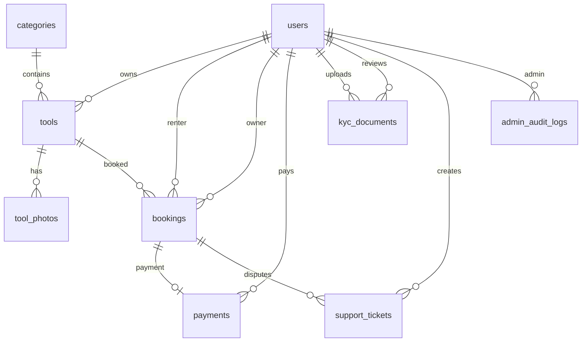

# Схема БД Sosedi MVP

Источник истины: `backend/prisma/schema.prisma`.

Миграция: `backend/prisma/migrations/20260602000100_init_database_schema/migration.sql`.

## Enums

| Enum | Значения | Назначение |
| --- | --- | --- |
| `UserRole` | `RENTER`, `OWNER`, `ADMIN` | Роль пользователя |
| `ToolStatus` | `PENDING`, `APPROVED`, `REJECTED`, `HIDDEN` | Модерация и видимость объявления |
| `BookingStatus` | `PENDING`, `CONFIRMED`, `PAID`, `ACTIVE`, `RETURNED`, `COMPLETED`, `CANCELLED` | Статус бронирования |
| `PaymentStatus` | `PENDING`, `SUCCEEDED`, `FAILED`, `CANCELED` | Статус платежа ЮKassa |
| `KycStatus` | `PENDING`, `VERIFIED`, `REJECTED` | Статус KYC |
| `KycDocumentType` | `PASSPORT`, `SELFIE` | Тип KYC-документа |
| `SupportTicketStatus` | `OPEN`, `IN_PROGRESS`, `CLOSED` | Статус обращения |
| `SupportTicketType` | `GENERAL`, `DISPUTE` | Обычное обращение или спор по бронированию |

## Tables

### `users`

Пользователи приложения: арендаторы, владельцы инструмента и администраторы.

| Поле | Тип | Описание |
| --- | --- | --- |
| `id` | `String uuid` | Primary key |
| `phone` | `String unique` | Телефон для OTP-авторизации |
| `name` | `String?` | Имя пользователя |
| `city` | `String?` | Город |
| `avatarUrl` | `String?` | URL аватара |
| `role` | `UserRole` | По умолчанию `RENTER` |
| `kycStatus` | `KycStatus?` | `null`, пока KYC не начат |
| `isBlocked` | `Boolean` | Блокировка пользователя |
| `deletedAt` | `DateTime?` | Мягкое удаление |
| `createdAt` | `DateTime` | Дата создания |
| `updatedAt` | `DateTime` | Дата обновления |

Индексы: `role`, `kycStatus`, `isBlocked`.

### `categories`

Плоский справочник категорий инструмента для MVP.

| Поле | Тип | Описание |
| --- | --- | --- |
| `id` | `String uuid` | Primary key |
| `name` | `String unique` | Название категории |
| `slug` | `String unique` | URL slug |
| `iconName` | `String?` | Имя иконки в UI |
| `sortOrder` | `Int` | Сортировка |
| `isActive` | `Boolean` | Показывать категорию |
| `createdAt` | `DateTime` | Дата создания |
| `updatedAt` | `DateTime` | Дата обновления |

Индексы: `(isActive, sortOrder)`.

### `tools`

Объявления владельцев о сдаче инструмента в аренду.

| Поле | Тип | Описание |
| --- | --- | --- |
| `id` | `String uuid` | Primary key |
| `ownerId` | `String` | FK на `users.id` |
| `categoryId` | `String` | FK на `categories.id` |
| `title` | `String` | Название объявления |
| `description` | `String` | Описание |
| `pricePerDay` | `Decimal(10,2)` | Цена за сутки |
| `depositAmount` | `Decimal(10,2)?` | Залог |
| `status` | `ToolStatus` | По умолчанию `PENDING` |
| `rejectReason` | `String?` | Причина отказа модерации |
| `address` | `String` | Человекочитаемый адрес |
| `latitude` | `Float` | Широта |
| `longitude` | `Float` | Долгота |
| `location` | `geography(Point,4326)?` | PostGIS точка для геопоиска |
| `createdAt` | `DateTime` | Дата создания |
| `updatedAt` | `DateTime` | Дата обновления |

Индексы: `ownerId`, `categoryId`, `status`, `pricePerDay`, `createdAt`, GiST `tools_location_idx`.

Ограничения: `latitude` от `-90` до `90`, `longitude` от `-180` до `180`.

### `tool_photos`

Фотографии инструмента после загрузки в S3.

| Поле | Тип | Описание |
| --- | --- | --- |
| `id` | `String uuid` | Primary key |
| `toolId` | `String` | FK на `tools.id` |
| `originalUrl` | `String` | Оригинал |
| `thumbnailUrl` | `String?` | Thumbnail |
| `previewUrl` | `String?` | Preview |
| `sortOrder` | `Int` | Порядок в галерее |
| `isCover` | `Boolean` | Обложка объявления |
| `createdAt` | `DateTime` | Дата создания |

Индексы: `toolId`, `(toolId, sortOrder)`.

Удаление: при удалении `tools` фотографии удаляются каскадно.

### `bookings`

Бронирования инструмента.

| Поле | Тип | Описание |
| --- | --- | --- |
| `id` | `String uuid` | Primary key |
| `toolId` | `String` | FK на `tools.id` |
| `renterId` | `String` | FK на арендатора `users.id` |
| `ownerId` | `String` | FK на владельца `users.id` |
| `startDate` | `Date` | Начало аренды |
| `endDate` | `Date` | Конец аренды |
| `totalAmount` | `Decimal(10,2)` | Итоговая сумма |
| `status` | `BookingStatus` | По умолчанию `PENDING` |
| `disputeOpenedAt` | `DateTime?` | Дата открытия спора |
| `createdAt` | `DateTime` | Дата создания |
| `updatedAt` | `DateTime` | Дата обновления |

Индексы: `toolId`, `renterId`, `ownerId`, `status`, `(startDate, endDate)`.

### `payments`

Платежи ЮKassa. В MVP нет холдов, split payments и автоматических выплат.

| Поле | Тип | Описание |
| --- | --- | --- |
| `id` | `String uuid` | Primary key |
| `bookingId` | `String unique` | FK на `bookings.id` |
| `userId` | `String` | FK на плательщика `users.id` |
| `amount` | `Decimal(10,2)` | Сумма |
| `status` | `PaymentStatus` | По умолчанию `PENDING` |
| `yookassaPaymentId` | `String? unique` | ID платежа ЮKassa |
| `checkoutUrl` | `String?` | URL оплаты |
| `rawPayload` | `Json?` | Raw webhook payload |
| `createdAt` | `DateTime` | Дата создания |
| `updatedAt` | `DateTime` | Дата обновления |

Индексы: `userId`, `status`.

### `kyc_documents`

KYC-документы владельцев инструмента. Файлы хранятся в приватном S3 bucket на территории РФ.

| Поле | Тип | Описание |
| --- | --- | --- |
| `id` | `String uuid` | Primary key |
| `userId` | `String` | FK на владельца `users.id` |
| `type` | `KycDocumentType` | Паспорт или селфи |
| `storageKey` | `String` | Ключ файла в приватном bucket |
| `status` | `KycStatus` | По умолчанию `PENDING` |
| `reviewComment` | `String?` | Комментарий администратора |
| `reviewedById` | `String?` | FK на администратора `users.id` |
| `reviewedAt` | `DateTime?` | Дата проверки |
| `createdAt` | `DateTime` | Дата создания |
| `updatedAt` | `DateTime` | Дата обновления |

Индексы: `userId`, `status`, `reviewedById`.

### `support_tickets`

Обращения в поддержку и споры по бронированиям.

| Поле | Тип | Описание |
| --- | --- | --- |
| `id` | `String uuid` | Primary key |
| `userId` | `String` | FK на автора `users.id` |
| `bookingId` | `String?` | FK на `bookings.id`, если это спор |
| `type` | `SupportTicketType` | По умолчанию `GENERAL` |
| `subject` | `String` | Тема |
| `message` | `String` | Сообщение |
| `status` | `SupportTicketStatus` | По умолчанию `OPEN` |
| `createdAt` | `DateTime` | Дата создания |
| `updatedAt` | `DateTime` | Дата обновления |

Индексы: `userId`, `bookingId`, `status`, `type`.

### `admin_audit_logs`

Аудит действий администратора.

| Поле | Тип | Описание |
| --- | --- | --- |
| `id` | `String uuid` | Primary key |
| `adminId` | `String?` | FK на администратора `users.id` |
| `action` | `String` | Код действия |
| `entityType` | `String?` | Тип сущности |
| `entityId` | `String?` | ID сущности |
| `metadata` | `Json?` | Дополнительные данные |
| `ipAddress` | `String?` | IP администратора |
| `createdAt` | `DateTime` | Дата действия |

Индексы: `adminId`, `(entityType, entityId)`, `createdAt`.

## Relations



## Geo Search

PostGIS включается первой миграцией:

```sql
CREATE EXTENSION IF NOT EXISTS postgis;
```

`tools.location` заполняется trigger'ом при создании или изменении координат:

```sql
ST_SetSRID(ST_MakePoint(longitude, latitude), 4326)::geography
```

Для поиска рядом использовать raw SQL:

```sql
ST_DWithin(
  tools.location,
  ST_SetSRID(ST_MakePoint(:longitude, :latitude), 4326)::geography,
  :radiusMeters
)
```

Максимальный радиус для MVP: `50000` метров.

Для сортировки по расстоянию:

```sql
ST_Distance(
  tools.location,
  ST_SetSRID(ST_MakePoint(:longitude, :latitude), 4326)::geography
)
```

