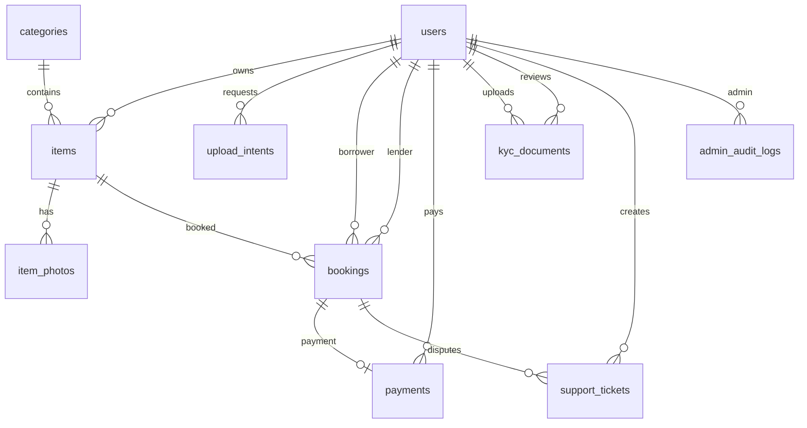

# Схема БД Sosedi MVP

Источник истины: `backend/prisma/schema.prisma`.

Миграции: `backend/prisma/migrations/`.

> **Статус после ADR-0001:** Prisma, REST, DTO, upload pipeline и moderation
> используют единый `Item`/`ItemPhoto` контракт без параллельного legacy API.
> Роль `USER` включает возможности брать чужие вещи и сдавать свои; объектный
> доступ к объявлению определяется `ownerId`.

## Enums

| Enum | Значения | Назначение |
| --- | --- | --- |
| `UserRole` | `USER`, `ADMIN` | Продуктовый пользователь или администратор |
| `AdminCapability` | `MODERATION`, `SUPPORT`, `KYC_REVIEW`, `FINANCE` | Минимальные полномочия администратора |
| `ItemStatus` | `PENDING`, `APPROVED`, `REJECTED`, `HIDDEN` | Модерация и видимость объявления |
| `ItemCondition` | `NEW`, `LIKE_NEW`, `GOOD`, `FAIR` | Общее состояние вещи |
| `BookingStatus` | `PENDING`, `CONFIRMED`, `ACTIVE`, `RETURNED`, `COMPLETED`, `CANCELLED` | Жизненный цикл аренды, отдельно от денег |
| `PaymentStatus` | `PENDING`, `SUCCEEDED`, `FAILED`, `CANCELLED` | Статус платежа |
| `PayoutStatus` | `PENDING`, `PROCESSING`, `SUCCEEDED`, `FAILED`, `CANCELLED` | Статус выплаты владельцу |
| `DisputeStatus` | `OPEN`, `UNDER_REVIEW`, `RESOLVED` | Минимальный статус финансового спора |
| `KycStatus` | `PENDING`, `VERIFIED`, `REJECTED` | Статус KYC |
| `KycDocumentType` | `PASSPORT`, `SELFIE` | Тип KYC-документа |
| `SupportTicketStatus` | `OPEN`, `IN_PROGRESS`, `CLOSED` | Статус обращения |
| `SupportTicketType` | `GENERAL`, `DISPUTE` | Обычное обращение или спор по бронированию |

## Tables

### `users`

Пользователи приложения. `USER` всегда может и брать чужие вещи, и сдавать свои;
`ADMIN` используется только вместе с отдельными административными capabilities.

| Поле | Тип | Описание |
| --- | --- | --- |
| `id` | `String uuid` | Primary key |
| `phone` | `String unique` | Телефон для OTP-авторизации |
| `name` | `String?` | Имя пользователя |
| `city` | `String?` | Город |
| `avatarUrl` | `String?` | URL аватара |
| `role` | `UserRole` | По умолчанию `USER` |
| `adminCapabilities` | `AdminCapability[]` | Пустой по умолчанию набор отдельных административных полномочий |
| `kycStatus` | `KycStatus?` | `null`, пока KYC не начат |
| `isBlocked` | `Boolean` | Блокировка пользователя |
| `sessionVersion` | `Int` | Поколение access/refresh/admin-сессий; увеличивается при блокировке и удалении |
| `deletedAt` | `DateTime?` | Момент подтверждённого закрытия: сессии отозваны, профиль и объявления исключены из публичного API |
| `anonymizedAt` | `DateTime?` | Момент очистки PII после завершения обязательств; `null` означает отложенную anonymization |
| `createdAt` | `DateTime` | Дата создания |
| `updatedAt` | `DateTime` | Дата обновления |

Индексы: `role`, `kycStatus`, `isBlocked`, `(deletedAt, anonymizedAt)` для
идемпотентной фоновой финализации закрытых аккаунтов.

### `categories`

Справочник категорий и server-side launch whitelist разрешённых вещей.

| Поле | Тип | Описание |
| --- | --- | --- |
| `id` | `String uuid` | Primary key |
| `name` | `String unique` | Название категории |
| `slug` | `String unique` | URL slug |
| `iconName` | `String?` | Имя иконки в UI |
| `sortOrder` | `Int` | Сортировка |
| `isActive` | `Boolean` | Показывать категорию |
| `isAllowedForListings` | `Boolean` | Server-side разрешение новых объявлений; по умолчанию `false` |
| `listingPolicy` | `CategoryListingPolicy` | `ALLOWED`, `RESTRICTED` или `PROHIBITED`; по умолчанию `RESTRICTED` |
| `safetyNotice` | `String` | Обязательное предупреждение длиной 10–500 символов |
| `createdAt` | `DateTime` | Дата создания |
| `updatedAt` | `DateTime` | Дата обновления |

Индексы: `(isActive, sortOrder)`.

DB constraint разрешает `isAllowedForListings = true` только при
`listingPolicy = ALLOWED`; restricted/prohibited категории отклоняются при
создании и смене категории объявления. Канонический перечень и границы:
[ADR-0003](adr/0003-launch-category-safety-policy.md).

### `items`

Нейтральная Prisma-модель `Item` для объявления платной аренды вещи. REST API:
`/api/v1/items`.

| Поле | Тип | Описание |
| --- | --- | --- |
| `id` | `String uuid` | Primary key |
| `ownerId` | `String` | FK на `users.id` |
| `categoryId` | `String` | FK на `categories.id` |
| `title` | `String` | Название объявления |
| `description` | `String` | Описание |
| `condition` | `ItemCondition` | Состояние вещи |
| `completeness` | `String` | Комплектация |
| `handoverTerms` | `String` | Условия личной передачи |
| `pricePerDay` | `Decimal(10,2)` | Цена за сутки |
| `depositAmount` | `Decimal(10,2)?` | Поле будущего залога; до отдельного утверждения API записывает только `null` или `0` |
| `status` | `ItemStatus` | По умолчанию `PENDING` |
| `rejectReason` | `String?` | Причина отказа модерации |
| `publicArea` | `String` | Модерируемый публичный район/округ без улицы и дома |
| `address` | `String` | Приватный pickup-адрес |
| `latitude` | `Float` | Приватная точная широта |
| `longitude` | `Float` | Приватная точная долгота |
| `location` | `geography(Point,4326)?` | PostGIS точка для геопоиска |
| `listingRulesVersion` | `String?` | Версия принятых правил публикации; `null` только у исторических Item |
| `listingRulesAcceptedAt` | `DateTime?` | Server timestamp принятия |
| `listingRulesAcceptanceMethod` | `String?` | Способ принятия `ITEM_CREATE_FORM` |
| `safetyNoticeSnapshot` | `String?` | Snapshot предупреждения выбранной категории на момент принятия |
| `createdAt` | `DateTime` | Дата создания |
| `updatedAt` | `DateTime` | Дата обновления |

Индексы: `ownerId`, `categoryId`, `status`, `pricePerDay`, `createdAt`, GiST `items_location_idx`.

Ограничения: `latitude` от `-90` до `90`, `longitude` от `-180` до `180`;
`publicArea` содержит от 2 до 120 символов, `completeness` и `handoverTerms` —
от 3 до 1000 символов. Acceptance-поля либо все `null` для исторического Item,
либо образуют полную запись с версией, server timestamp, способом принятия и
snapshot категорийного предупреждения. Текущий контракт:
[правила публикации объявления](item-listing-rules.md).
`pricePerDay` ограничен DB диапазоном `1..1_000_000 RUB`, а `depositAmount` до
отдельного решения допускает только `NULL` или `0`; `Decimal(10,2)` фиксирует
не более двух знаков после запятой.

### `item_photos`

Фотографии нейтральной Prisma-модели `Item` после загрузки в S3.

| Поле | Тип | Описание |
| --- | --- | --- |
| `id` | `String uuid` | Primary key |
| `itemId` | `String` | FK на `items.id` |
| `originalUrl` | `String` | Оригинал |
| `thumbnailUrl` | `String?` | Thumbnail |
| `previewUrl` | `String?` | Preview |
| `sortOrder` | `Int` | Порядок в галерее |
| `isCover` | `Boolean` | Обложка объявления |
| `createdAt` | `DateTime` | Дата создания |

Индексы: `itemId`, `(itemId, sortOrder)`.

Удаление: при удалении `items` фотографии удаляются каскадно.

### `upload_intents`

Короткоживущая привязка server-generated object key к actor и назначению
загрузки. Confirm принимает только `intentId`; key, bucket и entity берутся из
этой записи.

| Поле | Тип | Описание |
| --- | --- | --- |
| `id` | `String uuid` | Primary key и публичный идентификатор intent |
| `actorId` | `String` | FK на `users.id`, запросившего загрузку |
| `purpose` | `String` | Назначение, сейчас `ITEM_PHOTO` |
| `entityId` | `String` | ID сущности, определяемой назначением |
| `bucket` | `String` | Утверждённый backend bucket |
| `objectKey` | `String` | Уникальный backend-generated key |
| `contentType` | `String` | Заявленный MIME для presign |
| `sizeBytes` | `Int` | Заявленный размер |
| `expiresAt` | `DateTime` | Срок действия |
| `confirmedAt` | `DateTime?` | Время одноразового потребления |
| `createdAt` | `DateTime` | Дата создания |

Индексы: `actorId`, `entityId`, `expiresAt`; `objectKey` уникален. Удаление
`users` каскадно удаляет связанные intents.

### `bookings`

Бронирования вещей.

| Поле | Тип | Описание |
| --- | --- | --- |
| `id` | `String uuid` | Primary key |
| `itemId` | `String` | FK на `items.id` |
| `borrowerId` | `String` | FK на берущего вещь `users.id` |
| `lenderId` | `String` | FK на сдающего вещь `users.id` |
| `clientRequestId` | `String?` | Idempotency key, уникальный для borrower |
| `clientRequestHash` | `String?` | Hash нормализованного create payload |
| `startDate` | `Date` | Начало аренды |
| `endDate` | `Date` | Конец аренды |
| `totalAmount` | `Decimal(10,2)` | Итоговая сумма |
| `status` | `BookingStatus` | По умолчанию `PENDING` |
| `expiresAt` | `DateTime?` | TTL живой заявки `PENDING` |
| `cancellationReason` | `String?` | Каноническая причина terminal отмены |
| `termsSnapshot` | `Json?` | Immutable price/handover/document versions и borrower acceptance actor/server-time/method |
| `disputeOpenedAt` | `DateTime?` | Дата открытия спора |
| `createdAt` | `DateTime` | Дата создания |
| `updatedAt` | `DateTime` | Дата обновления |

Индексы: `itemId`, `borrowerId`, `lenderId`, `status`, `expiresAt`,
`(startDate, endDate)`; unique `(borrowerId, clientRequestId)`.
DB constraint запрещает `borrowerId = lenderId`.
`totalAmount` дополнительно ограничен диапазоном `1..30_000_000 RUB`; полный
price breakdown и его арифметические инварианты хранятся в immutable
`termsSnapshot`.

`PAID` не входит в `BookingStatus`: состояние денег хранится отдельно в
`PaymentStatus`. Канонические переходы, actors и preconditions находятся в
`backend/src/common/domain/workflow-contract.ts`.

### `payments`

Платежная модель ниже пока является провайдер-независимой заготовкой.

> **Изменение решения от 25.07.2026**
>
> **Раньше:** для MVP планировался простой checkout + webhook без hold, split и
> автоматических выплат.
>
> **Теперь:** до production-интеграции нужно выбрать согласованную с ЮKassa
> «Безопасную сделку» либо оплату при передаче вещи без приема денег
> платформой. До выбора разрешены fake provider и тестирование доменных
> переходов.
>
> **Почему:** прежняя схема не описывала расчет с частным владельцем, возврат,
> комиссию и спор. Provider-specific поля добавляются только после business,
> legal и provider approval.

| Поле | Тип | Описание |
| --- | --- | --- |
| `id` | `String uuid` | Primary key |
| `bookingId` | `String unique` | FK на `bookings.id` |
| `userId` | `String` | FK на плательщика `users.id` |
| `amount` | `Decimal(10,2)` | Сумма |
| `status` | `PaymentStatus` | По умолчанию `PENDING` |
| `yookassaPaymentId` | `String? unique` | ID платежа ЮKassa |
| `checkoutUrl` | `String?` | URL оплаты |
| `rawPayload` | `Json?` | Raw webhook payload |
| `createdAt` | `DateTime` | Дата создания |
| `updatedAt` | `DateTime` | Дата обновления |

Индексы: `userId`, `status`.
Provisional `amount` ограничен DB диапазоном `1..30_000_000 RUB`. Таблица не
имеет HTTP-поверхности до provider/legal ADR и будет заменена отдельной
provider-specific migration, а не расширена неутверждённым production flow.

Money `CHECK` constraints добавлены как PostgreSQL `NOT VALID`: они сразу
защищают новые и изменяемые строки, но не переписывают и не блокируют migration
из-за возможных legacy prototype-значений. Перед production их отдельный
inventory должен очистить/архивировать допустимым способом и выполнить
`VALIDATE CONSTRAINT`.

### `kyc_documents`

KYC-документы сдающих пользователей. Файлы хранятся в приватном S3 bucket на
территории РФ.

> **Изменение решения от 25.07.2026:** раньше наличие приватного bucket
> считалось достаточным условием для реализации паспорта и селфи. Теперь эта
> таблица остается заготовкой до legal gate по необходимости, биометрии,
> согласию, ограничениям функций, retention и удалению. Причина — техническая
> приватность хранилища сама по себе не создаёт правового основания обработки.

| Поле | Тип | Описание |
| --- | --- | --- |
| `id` | `String uuid` | Primary key |
| `userId` | `String` | FK на владельца `users.id` |
| `type` | `KycDocumentType` | Паспорт или селфи |
| `storageKey` | `String` | Ключ файла в приватном bucket |
| `status` | `KycStatus` | По умолчанию `PENDING` |
| `reviewComment` | `String?` | Комментарий администратора |
| `reviewedById` | `String?` | FK на администратора `users.id` |
| `reviewedAt` | `DateTime?` | Дата проверки |
| `createdAt` | `DateTime` | Дата создания |
| `updatedAt` | `DateTime` | Дата обновления |

Индексы: `userId`, `status`, `reviewedById`.

### `support_tickets`

Обращения в поддержку и споры по бронированиям.

| Поле | Тип | Описание |
| --- | --- | --- |
| `id` | `String uuid` | Primary key |
| `userId` | `String` | FK на автора `users.id` |
| `bookingId` | `String?` | FK на `bookings.id`, если это спор |
| `type` | `SupportTicketType` | По умолчанию `GENERAL` |
| `subject` | `String` | Тема |
| `message` | `String` | Сообщение |
| `status` | `SupportTicketStatus` | По умолчанию `OPEN` |
| `createdAt` | `DateTime` | Дата создания |
| `updatedAt` | `DateTime` | Дата обновления |

Индексы: `userId`, `bookingId`, `status`, `type`.

### `admin_audit_logs`

Аудит действий администратора.

| Поле | Тип | Описание |
| --- | --- | --- |
| `id` | `String uuid` | Primary key |
| `adminId` | `String?` | FK на администратора `users.id` |
| `action` | `String` | Код действия |
| `entityType` | `String?` | Тип сущности |
| `entityId` | `String?` | ID сущности |
| `capability` | `AdminCapability?` | Полномочие, разрешившее действие |
| `reason` | `String?` | Нормализованная причина решения |
| `requestId` | `String?` | Корреляционный ID HTTP/operational запроса |
| `ipAddress` | `String?` | IP администратора |
| `deviceId` | `String?` | Усечённый SHA-256 User-Agent, без raw строки |
| `before` | `Json?` | Минимальный state до изменения, без ПД |
| `after` | `Json?` | Минимальный state после изменения, без ПД |
| `metadata` | `Json?` | Только безопасные данные operational/MFA событий |
| `createdAt` | `DateTime` | Дата действия |

Индексы: `adminId`, `(entityType, entityId)`, `createdAt`.
DB trigger отклоняет `UPDATE` и `DELETE`; тестовая очистка использует `TRUNCATE`
только после проверки локальной test DB.

## Relations



## Geo Search

PostGIS включается первой миграцией:

```sql
CREATE EXTENSION IF NOT EXISTS postgis;
```

`items.location` заполняется trigger'ом при создании или изменении координат:

```sql
ST_SetSRID(ST_MakePoint(longitude, latitude), 4326)::geography
```

Для поиска рядом использовать raw SQL:

```sql
ST_DWithin(
  items.location,
  ST_SetSRID(ST_MakePoint(:longitude, :latitude), 4326)::geography,
  :radiusMeters
)
```

Максимальный радиус для MVP: `50000` метров.

Для сортировки по расстоянию:

```sql
ST_Distance(
  items.location,
  ST_SetSRID(ST_MakePoint(:longitude, :latitude), 4326)::geography
)
```

Публичные `GET /api/v1/items` и `GET /api/v1/items/:id` возвращают
`distanceBucket`, `publicArea` как `area` и стабильный центр coarse-cell. Для MVP
всегда применяется консервативная сетка `SPARSE` размером `0.1°`; случайный jitter
на каждый запрос запрещён. Публичные radius filter, distance sort и bucket
вычисляются по этой же coarse-точке, чтобы повторные запросы не превращали точный
`ST_DWithin`/`ST_Distance` в oracle для триангуляции. Exact address/coordinates и
`originalUrl` фото остаются только в приватных owner/admin DTO.
